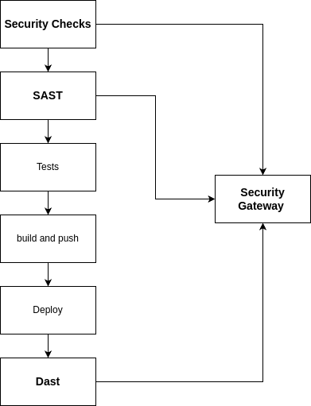
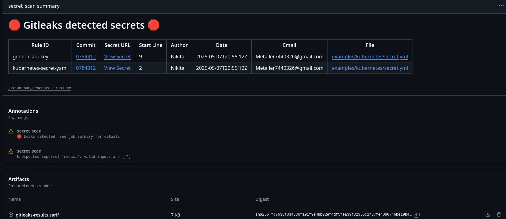
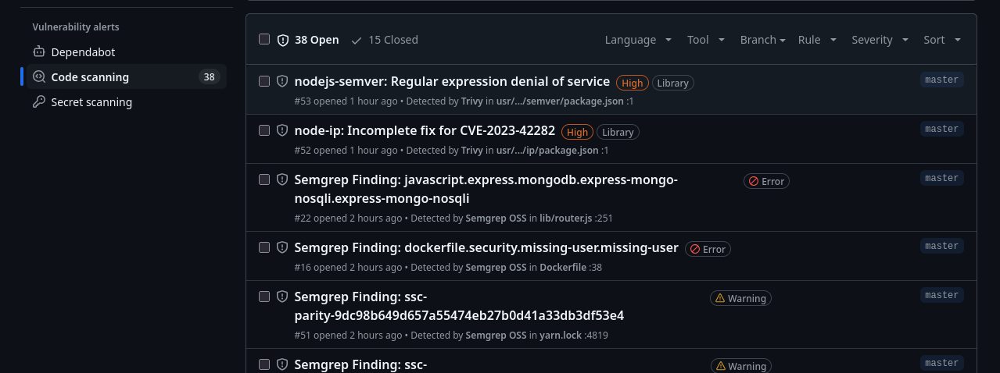
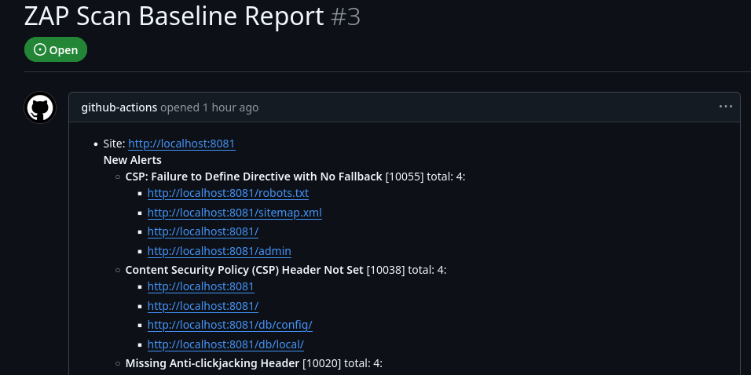

Этапы CICD



***
# Конфигурация CI/CD Pipeline в GitHub Actions

## Обзор Workflow
- **Название**: `cicd`
- **Триггеры**:
  - При `pull_request` 
  - При `push` в ветку `master` 

## Задачи (Jobs)

### 1. Поиск секретов (`secret_scan`)
- **Цель**: Обнаружение секретов в коде
- **Среда**: Ubuntu latest
- **Шаги**:
  1. Загрузка кода
  2. Сканирование на секреты с помощью Gitleaks (с маскировкой)
- **Отчет**:
  1. Выгружается в CI 
     

### 2. Статический анализ безопасности (`sast`)
- **Цель**: Анализ кода на уязвимости
- **Среда**: Ubuntu latest (инструмент Semgrep)
- **Права**:
  - Запись в contents, packages, security events
  - Чтение actions
- **Переменные**: SEMGREP_APP_TOKEN из secrets
- **Шаги**:
  1. Загрузка кода
  2. Запуск Semgrep (результаты в формате SARIF)
  3. Загрузка отчета в GitHub Security
  4. Сохранение JSON-отчета как артефакта
- **Отчет**:
  1. Выгружается в CI  
  2. В github code-scanning: https://github.com/Metaller000/mongo-express/security/code-scanning
  
  3. Систему менеджмента уязвимостей: https://semgrep.dev/orgs/metaller7440326_personal_org/findings?tab=open&primary=true&last_opened=All%20time

### 3. Сборка Docker и проверка безопасности (`check-push`)
- **Зависимости**: Требует завершения `sast`
- **Цель**: Сборка образа и проверка безопасности образа (инструмент Trivy)
- **Среда**: Ubuntu latest
- **Права**: Аналогично SAST
- **Переменные**: Реестр Docker Hub (`docker.io`)
- **Шаги**:
  1. Загрузка кода
  2. Проверка учетных данных Docker Hub
  3. Авторизация в Docker Hub
  4. Получение короткого SHA коммита
  5. Сборка Docker образа (теги: SHA + latest)
  6. Сканирование образа Trivy (результаты в SARIF)
  7. Загрузка результатов в GitHub Security
  8. Сохранение отчета как артефакта
  9. Пуш образов в Docker Hub (если предыдущие шаги успешны)
- **Отчет**:
  1. Выгружается в CI  
  2. В github code-scanning: https://github.com/Metaller000/mongo-express/security/code-scanning

### 4. Динамический анализ безопасности (`dast`)
- **Зависимости**: Требует завершения `check-push`
- **Цель**: Тестирование безопасности работающего приложения
- **Среда**: Ubuntu latest (иструмент ZAP)
- **Переменные**: Реестр Docker Hub (`docker.io`)
- **Сервисы**:
  - Контейнер MongoDB с авторизацией из secrets
- **Шаги**:
  1. Запуск контейнера приложения с подключением к MongoDB
  2. Запуск OWASP ZAP сканирования
  3. Остановка и удаление контейнеров
- **Отчет**:
  1. Выгружается в CI  
  2. В github issues: https://github.com/Metaller000/mongo-express/issues
     
- **Детали**
    ```
    Загрузка образа происходит на сервер docker.io: https://hub.docker.com/r/metaller000/me-netology/tags, загружается 2 тега: с номером коммита и latest
    ```

### 5. Деплой (`deploy`)
- **Зависимости**: Требует завершения `check-push`
- **Цель**: Развертывание приложения
- **Среда**: Ubuntu latest
- **Шаги**:
  1. Установка SSH-ключа из secrets
  2. Выполнение удаленного скрипта деплоя через SSH
- **Детали**
    ```
    Деплой происходит на виртуалку с предустановленной mongoDB, при этом обновляется только целевое ПО, настройти авторизации БД и Авторизации на сервис расположены на виртуальной машине, деплой произходит вызоом по ssh предустановленного скрипта. Скрипт обновляет контейнер и перезапускает.    
    ```
## Ключевые особенности CICD:
- Многоуровневая проверка безопасности (секреты, SAST, контейнеры, DAST)
- Генерация отчетов в виде артефактов
- Сборка и публикация Docker образов
- Деплой через SSH
- Работа с чувствительными данными через GitHub Secrets


## Примечание:
```
Сканирование секретов сделано не блокирующим, так как в форке присутствуют креды деплоя в k8s, в противном случае произойдет блокировка дальнейшей сборки и деплоя.
```